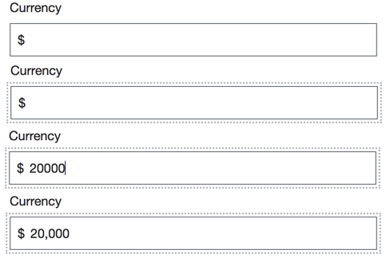
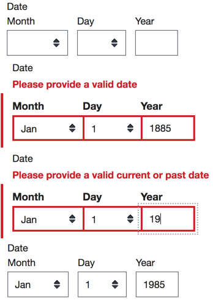
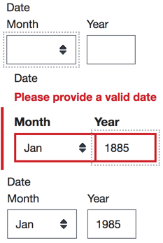
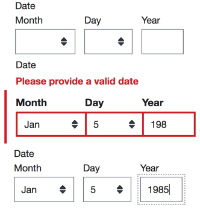
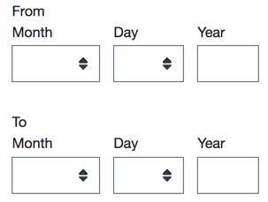
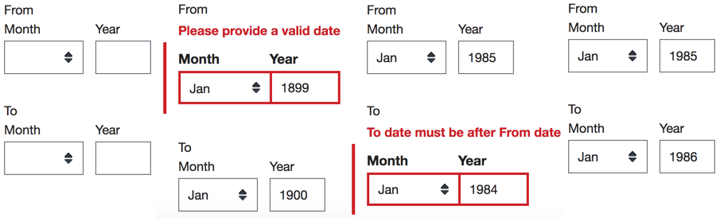
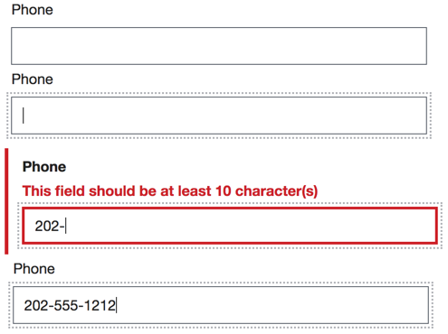
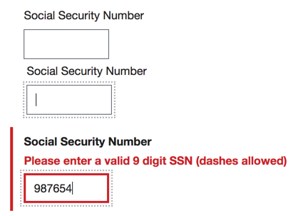
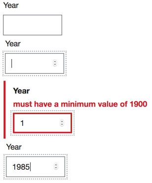

:book: [*US Forms System Documentation*](../README.md) :arrow_right: [*Building a Form*](./README.md)

# Common definitions

Definitions, located in [/src/js/definitions](../../src/js/definitions), are pieces of the form config that can be dropped in to represent specific types of questions. They include features such as label text, validation functions, error messages, and rules for which widget to render.

Definitions export `schema` and `uiSchema` objects, which are functions that require certain parameters.

### Using definitions

To use a definition, import it near the top of the file you want to reference it in:

```js
import currencyConfig from 'us-forms-system/lib/js/definitions/currency';
```

Then, call it to add the `schema` and `uiSchema` functions. The definition is a function that takes the title for that field, which is used to populate the 'ui:title' property in uiSchema:

```js
uiSchema: {
  ...
  currency: currencyConfig.uiSchema('Currency'),
  ...
}
schema: {
  ...
  currency: currencyConfig.schema(),
  ...
}
```

Available definitions are:

- [Autosuggest](#autosuggest)
- [Currency](#currency)
- [Current or past dates](#current-or-past-dates)
- [Current or past month/year](#current-or-past-monthyear)
- [Date](#date)
- [Date range](#date-range)
- [File upload](#file-upload)
- [Month/year](#monthyear)
- [Month/year range](#monthyear-range)
- [Phone](#phone)
- [Social Security Number](#social-security-number)
- [Year](#year)

### Autosuggest

A common type-ahead widget that lets a user type in values and narrow down a longer list of options. It is most commonly used with an `enum` of the available options as shown here. Define the uiSchema by calling the function that you import. You can pass an object with additional uiSchema properties.

```js
import { uiSchema as autosuggestUI } from 'us-forms-system/lib/js/definitions/autosuggest';

function schema() {
  return {
    type: 'object'
    properties: {
      officeLocation: {
        type: 'string',
        enum: [
          'LA', 'NY', 'CH'
        ],
        enumNames: [
          'Los Angeles',
          'New York',
          'Chicago'
        ]
      }
    }
  }
},
uiSchema: {
  officeLocation: autosuggestUI(
    'Preferred Office Location',  // field title
    null,         // Promise to get options (optional)
    {             // Additional uiSchema options
      'ui:options': {
        // When labels are not provided, it uses enumNames
        labels: { }
      }
    }
  )
}
```
Source: [/src/js/definitions/autosuggest.js](../../src/js/definitions/autosuggest.js)

### Currency

Formats and validates a US currency field that includes a leading `$` character. You can pass this function a label to be used on the field.



```js
import { currencyConfig } from 'us-forms-system/lib/js/definitions/currency';

uiSchema: {
  currency: currencyConfig.uiSchema('Currency')
},
schema: {
  type: 'object',
  properties: {
    currency: currencyConfig.schema()
  }
}
```
Source: [/src/js/definitions/currency.js](../../src/js/definitions/currency.js)

### Current or past dates

The common date field with validation warning that dates in the past or future are not valid. You can pass this function a label to be used on the field. Dates must be on or before January 1, 1900.



```js
import { currentOrPastDateConfig } from 'us-forms-system/lib/js/definitions/currentOrPastDate';

uiSchema: {
  currentOrPastDate: currentOrPastDateConfig.uiSchema()
},
schema: {
  type: 'object'
  properties: {
    currentOrPastDate: currentOrPastDateConfig.schema()
  }
}
```
Source: [/src/js/definitions/currentOrPastDate.js](../../src/js/definitions/currentOrPastDate.js)

### Current or past month/year

The common date field with only month and year fields and with validation warning that dates in the past or future are not valid. You can pass this function a label to be used on the field. Dates must be on or before January 1, 1900.



```js
import { currentOrPastMonthYearConfig } from 'us-forms-system/lib/js/definitions/currentOrPastMonthYear';

uiSchema: {
  currentOrPastMonthYear: currentOrPastMonthYearConfig.uiSchema()
},
schema: {
  type: 'object',
  properties: {
    currentOrPastMonthYear: currentOrPastMonthYearConfig.schema()
  }
}
```
Source:  [/src/js/definitions/currentOrPastMonthYear.js](../../src/js/definitions/currentOrPastMonthYear.js)

### Date

The common date field with basic date validation. You can pass this function the label to be used on the field. Dates must be on or before January 1, 1900.



```js
import { dateConfig } from 'us-forms-system/lib/js/definitions/date';

uiSchema: {
  date: dateConfig.uiSchema()
},
schema: {
  type: 'object',
  properties: {
    date: dateConfig.schema()
  }
}
```
Source: [/src/js/definitions/date.js](../../src/js/definitions/date.js)

### Date range

Two common date fields with validation to ensure they form a valid range. Dates must be on or before January 1, 1900.



```js
import { dateRangeConfig } from 'us-forms-system/lib/js/definitions/dateRange';

uiSchema: {
  dateRange: dateRangeConfig.uiSchema()
},
schema: {
  type: 'object',
  properties: {
    dateRange: dateRangeConfig.schema()
  }
}
```
Source: [/src/js/definitions/dateRange.js](../../src/js/definitions/dateRange.js)

### File upload

*Note: This is currently not functional. The file upload field requires a specified endpoint for the upload. Documentation will be updated later.*

Source: [/src/js/definitions/file.js](../../src/js/definitions/file.js)

### Month/year

The common date field, excluding day field, with basic validation. Dates must be on or before January 1, 1900. You can call this function with the label to be displayed on the field.


```js
import { monthYearConfig } from 'us-forms-system/lib/js/definitions/monthYear';

uiSchema: {
  monthYear: monthYearConfig.uiSchema()
},
schema: {
  type: 'object',
  properties: {
    monthYear: monthYearConfig.schema()
  }
}
```
Source: [/src/js/definitions/monthYear.js](../../src/js/definitions/monthYear.js)

### Month/year range

Two common date fields, excluding day field, with validation to ensure the dates form a valid range. Dates must be on or before January 1, 1900.



```js
import { monthYearRangeConfig } from 'us-forms-system/lib/js/definitions/monthYearRange';

uiSchema: {
  monthYearRange: monthYearRangeConfig.uiSchema()
},
schema: {
  type: 'object',
  properties: {
    monthYearRange: monthYearRangeConfig.schema()
  }
}
```
Source: [/src/js/definitions/monthYearRange.js](../../src/js/definitions/monthYearRange.js)

### Phone

A phone number with basic validation. You can pass this function the label to be used on the field.



```js
import { phoneConfig } from 'us-forms-system/lib/js/definitions/phone';

uiSchema: {
  phone: phoneConfig.uiSchema()
},
schema: {
  type: 'object',
  properties: {
    phone: phoneConfig.schema()
  }
}
```
Source: [/src/js/definitions/phone.js](../../src/js/definitions/phone.js)

### Social Security Number

A US social security number field with validation.



```js
import { ssnConfig } from 'us-forms-system/lib/js/definitions/ssn';

uiSchema: {
  ssn: ssnConfig.uiSchema()
},
schema: {
  type: 'object',
  properties: {
    ssn: ssnConfig.schema()
  }
}
```
Source: [/src/js/definitions/ssn.js](../../src/js/definitions/ssn.js)

### Year

A text field that validates the current or a past year. Dates must be on or before January 1, 1900.



```js
import { yearConfig } from 'us-forms-system/lib/js/definitions/year';

uiSchema: {
  year: yearConfig.uiSchema()
},
schema: {
  type: 'object',
  properties: {
    year: yearConfig.schema()
  }
}
```
Source: [/src/js/definitions/year.js](../../src/js/definitions/year.js)


[Back to *Building a Form*](./README.md)
