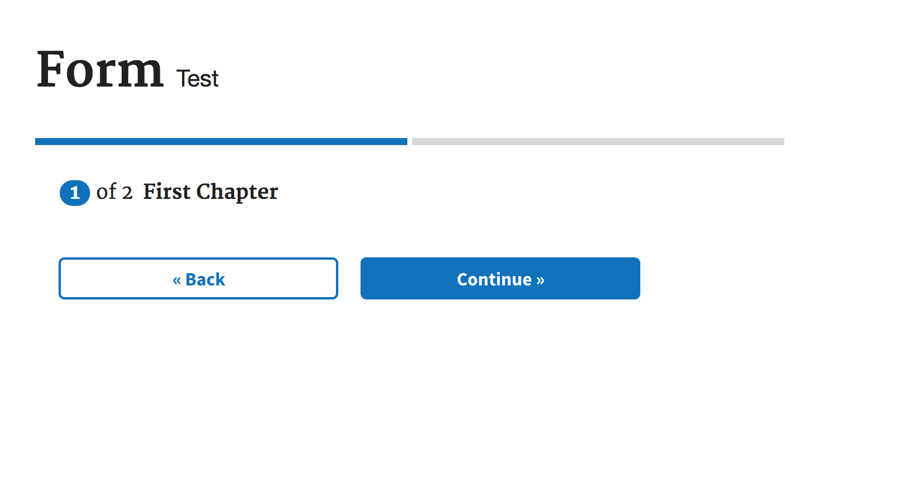
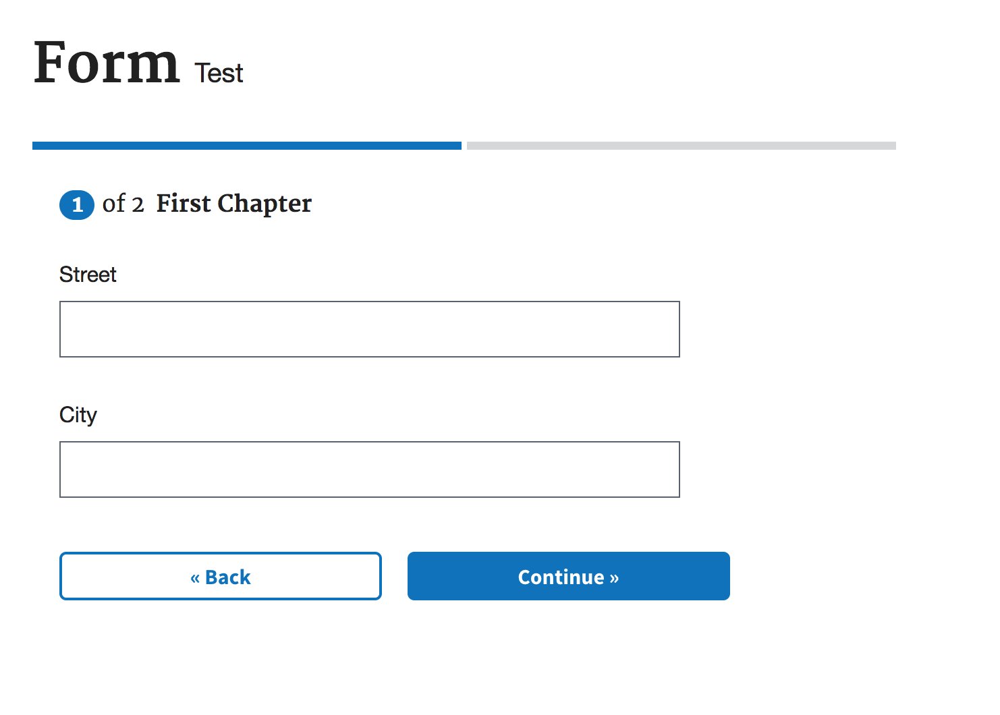
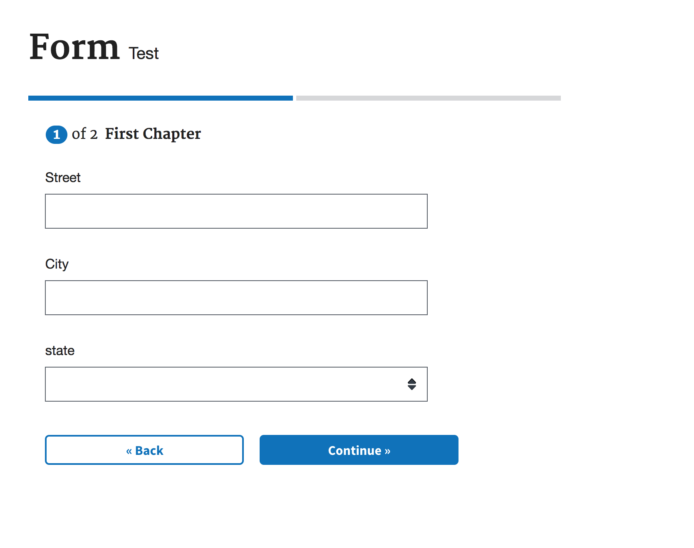
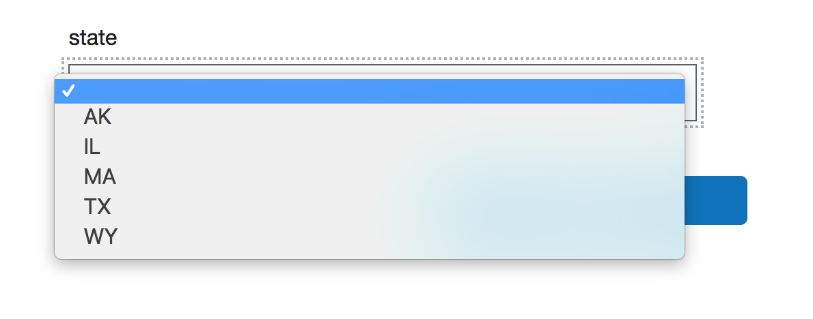
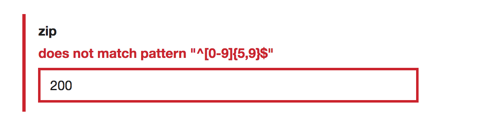
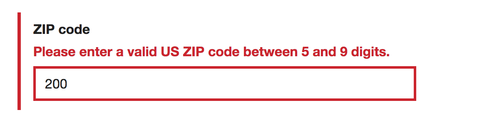

# Tutorial

Learn the basics of the US Forms System library, with no knowledge of React required, by building a simple form that asks for an address.

### In this tutorial

- [Step 1: Install the starter app](#step-1-install-the-starter-app)
- [Step 2: Get familiar with the form config](#step-2-get-familiar-with-the-form-config)
- [Step 3: Understand chapters and pages](#step-3-understand-chapters-and-pages)
- [Step 4: Add the `schema` object](#step-4-add-the-schema-object)
- [Step 5: Render the form so far](#step-5-render-the-form-so-far)
- [Step 6: Add a question](#step-6-add-a-question)
- [Step 7: Add the `uiSchema` object](#step-7-add-the-uischema-object)
- [Step 8: Add another `string` question](#step-8-add-another-string-question)
- [Step 9: Add a select field](#step-9-add-a-select-field)
- [Step 10: Add specific data constraints and validation](#step-10-add-specific-data-constraints-and-validation)
- [Review](#review)

### Step 1: Install the starter app

The the fastest way to start building a form using the US Forms System library is to install the US Forms System Starter App. The starter app includes the initial files, configuration, build process, and web server you need to start building your form immediately. For installation instructions, see "[Creating a new application with the US Forms System Starter App](creating-a-new-application-with-the-us-forms-system-starter-app.md)."

### Step 2: Get familiar with the form config

The starter app code includes a file under `js/config/` called `form.js`. This is the main file you'll be interacting with to build your form. It includes almost everything that goes into your form, including the questions your form will contain, how those questions are displayed to the user, and the organization of the different sections of your form. The library works by reading through your form config in order to determine how to build your form.

There are several properties in the top level of the `formConfig` object. You can learn more about them later in our [Quick start guide](../building-a-form/quick-start-example-formjs-file.md).

### Step 3: Understand chapters and pages

In this tutorial, you'll be working on the section of the `formConfig` within `chapters`. Forms are organized into *chapters*, which are broader topics, and *pages*, which are separate pages of questions within that topic. For example, a form may have a chapter on personal information, and separate pages within that chapter for name, address, and other contact information.

The starter app includes two chapters, `firstChapter` and `secondChapter`. The `firstChapter` object includes the `title` of the chapter, as well as an object containing the `page`s within that chapter. Each page is also an object.

```js
const formConfig = {
  title: 'Form',
  subTitle: 'Test',
  ...
  chapters: {
    firstChapter: {
      title: 'First Chapter',
      pages: {
        firstPage: {
          path: 'first-chapter/first-page',
          title: 'First Page',
          ...
        }
      }
    }
  }
}      
```

Each page also includes `path` and `title` properties: `path` takes the url of that page, and `title`, unsurprisingly, takes the title of that page.

### Step 4: Add the `schema` object

Now that you have the page structure of your form, you can start adding questions! To do this, add the `schema` object to the `firstPage` object.

You can think about the information contained in the `schema` object as a description of the type of data each question accepts. The `schema` follows the JSON Schema standard, which specifies the allowed shape of JSON objects. For more information about the JSON Schema Standard, see [Understanding JSON Schema](https://spacetelescope.github.io/understanding-json-schema/).

Each `schema` object must always contain the following properties:
- `type: 'object'`: this describes the shape of the `schema` data
- `properties: {}`: an object containing the fields within that `schema`

Note: when you begin building forms, it's common to receive an error for forgetting one of these two required properties in your `schema` objects. The error will appear in your console as `Error found in schema: Missing type in root schema.`.

With these two properties, your schema should look like this:

```js
...
firstPage: {
  path: 'first-chapter/first-page',
  title: 'First Page',
  schema: {
    type: 'object',
    properties: {

    }
  }
}
...
```

### Step 5: Render the form so far

Take a look at your form by runing `npm start` in your terminal at the starter app directory. This will automatically open a browser window with your form app rendered. The first page is an introduction, which you'll learn more about later. For now, skip it by clicking the "Start Form" button, which takes you to the first page of the form.

This is what you should see:


You'll notice a few things:
- The title and subtitle of the form at the top, which you can change at the top level of the `formConfig`.
- A progress bar with 2 segments. Each segment corresponds to a `chapter` of your form; the number of segments to display is determined by the library based on how many `chapter`s you've added to your config.
- The "step" of the form you're on out of how many steps there are. Again, steps correspond to the number of `chapter`s, and the current step is the number of the current `chapter`.
- The `title` of the `chapter`.
- The navigation buttons, "Back" and "Continue".

There's nothing else on this page because we haven't added any questions yet.

### Step 6: Add a question

For your simple address form, you'll start by asking for the street. Add a field for street within the `schema: { properties: {}}` object you just created.

```js
...
  schema: {
    type: 'object',
    properties: {
      street: {
        type: 'string'
      }
    }
  }
...
```

The webpack server you started when you typed `npm start` in Step 5 should have automatically refreshed the page with your form. Go back to your browser to take a look at what's there.

This is what you should see:


Excellent, now you have a form field! But how did the library know to render a text input with a label of `street` based on what you added to the `schema`?

The `street` field accepts `string` data. For basic data types, an automatic determination is made by the library on what type of HTML form element to render. `string` data renders a text input, a field with an `enum` property renders a select, and `boolean` data renders checkbox.

The label is taken from the name of the field in the `formConfig`. `street` becomes "street" in your form. But what if we want to change the label text? We can do that be editing the `uiSchema` object, which we'll learn about next.
 
### Step 7: Add the `uiSchema` object

While the `schema` describes the fields of a form and the type of data each field accepts, there are UI-specific things you may want to change about how those fields appear to the user.

That's where `uiSchema` comes in. Think of the `uiSchema` object as a mirror of `schema`. It usually has the same fields as the `schema` object, but with different properties to specify UI-specific characteristics of that field.

Returning to the example of changing the label text of the `street` field, pass a property to the `uiSchema` under `street` called `ui:title`. `ui:title` lets you specify the exact label text you want displayed. This is how your `formConfig` would look:

```js
...
  schema: {
    type: 'object',
    properties: {
      street: {
        type: 'string'
      }
    }
  },
  uiSchema: {
    street: {
      'ui:title': 'Street'
    }
  }
...
```
Most properties that are passed to `uiSchema` are prefixed with `ui:`, which means they need to be passed as a quoted string to `formConfig`.

Go back to your browser window to see the form again. Because you overrode the default label text by adding `'ui:title': 'Street'` to your `formConfig`, your label text has changed from "street" to "Street".

### Step 8: Add another `string` question

Now that we understand the basics of adding fields to our `formConfig`, it's time to add more questions. On your own, add a field for the city in the address. The field should use a text input.

(We'll wait a few minutes while you add the field)

Did it work? Let's compare our `formConfig`:

```js
...
  schema: {
    type: 'object',
    properties: {
      street: {
        type: 'string'
      },
      city: {
        type: 'string'
      }
    }
  },
  uiSchema: {
    street: {
      'ui:title': 'Street'
    },
    city: {
      'ui:title': 'City'
    }
  }
...
```

This is now what your form looks like:


You're now halfway to a complete address!

### Step 9: Add a select field

In Step 6, you learned that the library makes default determinations about the type of field to render based on the type of data. This applies to select fields as well. A select is rendered when the data is `type: 'string'` and an `enum` property is passed in.

The `enum` property takes an array of the valid options for that field. For states, we pass string values to the `enum` array for the states we want to include. We'll just add five so we don't have to add all 50 states and 14 territories. Add a few of your favorite states to your `formConfig`.

Your `formConfig` for states might look like this:

```js
...
  schema: {
    type: 'object',
    properties: {
      street: {
        type: 'string'
      },
      city: {
        type: 'string'
      },
      states: {
        type: 'string',
        enum: ['AK', 'IL', 'MA', 'TX', 'WY']
      }
    }
  },
...
```

This is how your form looks after adding this additional `schema` property:


Behold, a dropdown of states! And it contains exactly the states we passed to it:


As you've seen, the state names come directly from the `schema`, but what's rendered isn't as user-friendly as it could be. The back-end may only accept abbreviations, but users should still be able to see the full state name.

You can specify the text that appears to the user for each option in the uiSchema by passing a `labels` object to that field:

```js
...
  schema: {
    type: 'object',
    properties: {
      street: {
        type: 'string'
      },
      city: {
        type: 'string'
      },
      state: {
        type: 'string',
        enum: ['AK', 'IL', 'MA', 'TX', 'WY']
      },
    }
  },
  uiSchema: {
    street: {
      'ui:title': 'Street'
    },
    city: {
      'ui:title': 'City'
    },
    state: {
      'ui:title': 'State',
      'ui:options': {
        labels: {
          AK: 'Alaska',
          IL: 'Illinois',
          MA: 'Massachusetts',
          TX: 'Texas',
          WY: 'Wyoming'
        }
      }
    },
  }
...
```

Some properties, like `labels`, are passed in a `ui:options` object within that field. For more information about which properties are available and how they get passed to `uiSchema`, see "[About the `schema` and `uiSchema` objects](../building-a-form/about-the-schema-and-uischema-objects.md)."

### Step 10: Add specific data constraints and validation

The last question in this address form lets the user provide a ZIP code. While ZIP codes are usually `string` data, they also need to follow specific formats, which means specifying data constraints in your `formConfig` through the `schema` object. The JSON Schema specification includes several properties to add constraints to the data accepted for that field, including `minLength`, `maxLength`, `format`, and `pattern`.

To validate ZIP code input, use the `pattern` property, which matches the user entry against a regex, as in this `schema`:
```js
...
  schema: {
    type: 'object',
    properties: {
      street: {
        type: 'string'
      },
      city: {
        type: 'string'
      },
      state: {
        type: 'string',
        enum: ['AK', 'IL', 'MA', 'TX', 'WY']
      },
      zip: {
        type: 'string',
        pattern: '^[0-9]{5,9}$'
      }
    }
  },
...
```

You're part way there; you have a ZIP code field. To test it, type an invalid ZIP code and focus away from the ZIP code field:


While the form caught that the entry wasn't correct and displayed an error, the error isn't particularly human-readable. You can add custom error messages to your form for specific cases. Because custom error messages are displayed to the user, they go in the `uiSchema`:

```js
...
  uiSchema: {
    street: {
      'ui:title': 'Street'
    },
    city: {
      'ui:title': 'City'
    },
    state: {
      'ui:title': 'State',
      'ui:options': {
        labels: {
          AK: 'Alaska',
          IL: 'Illinois',
          MA: 'Massachusetts',
          TX: 'Texas',
          WY: 'Wyoming'
        }
      }
    },
    zip: {
      'ui:title': 'ZIP code',
      'ui:errorMessages': {
        'pattern': 'Please enter a valid US ZIP code between 5 and 9 digits.'
      }
    }
  }
...
```

To display a custom error message, pass the `ui:errorMessages` object to `uiSchema` under the field for `zip`. `ui:errorMessages` takes key-value pairs, where the key is the name of the JSON Schema property that the entry violates, and the value is the user-friendly, descriptive message displayed for the violation.

Now you'll see a much more useful error message::


### Review

Well done! You've built your first form using only a JSON config file. Hopefully you are starting to see the benefits of describing the form as opposed to building all of the components and UI patterns directly.

There are so many more things you can do with US Forms Systems, including more complex form patterns, like conditionally expanded fields, custom validation functions, groups of similar questions, and more. Learn more about what's possible in "[Building a form](../building-a-form/README.md)".
