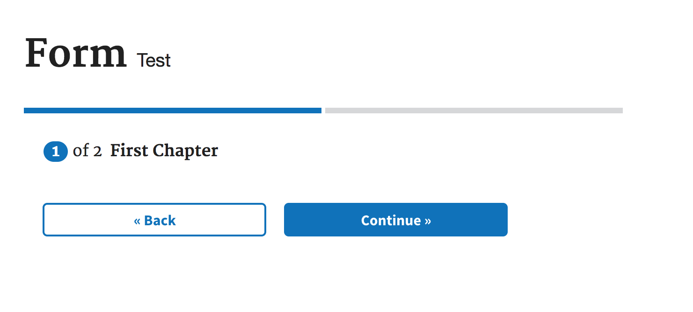

# Tutorial

Use this tutorial to learn the basics of using this library. This tutorial assumes no knowledge of our library or React.

## Tutorial steps

In 10 steps we'll be building a simple form for an address.

### Step 1: Installing the starter app

The first step to building a form using the US Forms System is to install our starter app. The starter app includes the initial files, configuration, build process, and web server you need to start building your form immediately. It's the fastest way to start learning how to use the library.

If you haven't already followed these [installation instructions](creating-a-new-application-with-the-us-forms-system-starter-app.md), complete those steps first and then come back here!

### Step 2: Getting familiar with the form config

In the starter app code, you'll notice a file under `js/config/` called `form.js`. This is the main file you'll be interacting with to build your form. Almost everything that goes into your form is entered in this file: the questions you want your form to contain, how those questions are displayed to the user, the organization of the different sections of your form, etc. The library code reads through your form config in order to determine how to build your form.

You'll notice several properties in the top level of the `formConfig` object. For now, you don't need to know too much about those. You can read more about them later in our [quick start example formjs file](../building-a-form/quick-start-example-formjs-file.md).

### Step 3: Understanding chapters and pages

The main part of the `formConfig` object that we'll be working with in this tutorial is section within `chapters`. Forms are organized into chapters, which are broader topics, and pages, which are specific sections or pages of questions within that topic. For example, you may have a chapter on personal information, and separate pages within that chapter for name, address, and other contact information.

The starter app sets up some initial chapters and pages for you. There are 2 chapters to this form, `firstChapter` and `secondChapter`. Within `firstChapter`, you'll see the `title` of the chapter and an object containing the `pages` within that chapter. Each page is also an object.

```js
const formConfig = {
  title: 'Form',
  subTitle: 'Test',
  ...
  chapters: {
    firstChapter: {
      title: 'First Chapter',
      pages: {
        firstPage: {
          path: 'first-chapter/first-page',
          title: 'First Page',
          ...
        }
      }
    }
  }
}      
```

Within each page you'll also see `path` and `title` properties: the `path` property takes the url of that page, and the `title`, unsurprisingly, takes the title of that page.

### Step 4: Adding the `schema` object

Now that we have the page structure of our form, we want to start adding questions! We do so by adding the `schema` object to our `firstPage` object.

The `schema` object takes the JSON Schema specification of our questions. You can think about the information contained in the `schema` object as a description of the type of data each question accepts. The `schema` object follows the JSON Schema standard, which describes the allowed shape of JSON objects. For more information about the JSON Schema Standard, see [Understanding JSON Schema](https://spacetelescope.github.io/understanding-json-schema/).

Each `schema` object within your form always need to contain the following properties:
1. `type: 'object'`: this describes the shape of the `schema` data
2. `properties: {}`: an object containing the fields within that `schema`

Note: when you begin building forms, it's common to receive an error for forgetting one of these two required properties in your `schema` objects.

Adding these two properties, our schema should look like this:

```js
...
firstPage: {
  path: 'first-chapter/first-page',
  title: 'First Page',
  schema: {
    type: 'object',
    properties: {

    }
  }
}
...
```

### Step 5: Render the form so far

It's time to take a look at our form so far! Run `npm start` in your terminal at the starter app directory, which will automatically open a browser window with the app. You'll first see an introduction page, which we will describe in more detail later. For now, skip the introduction by clicking the "Start Form" button, which takes you to the first page of the form.

This is what you should see:


You'll notice a few things:
1. The title and subtitle of the form at the top, which you can change at the top level of the `formConfig`.
2. A progress bar with 2 segments. Each segment corresponds to a `chapter` of your form; the number of segments to display is determined by the library based on how many `chapter`s you've added to your config.
3. The "step" of the form you're on out of how many steps there are. Again, steps correspond to the number of `chapter`s, and the current step is the number of the current `chapter`.
4. The `title` of the `chapter`.
5. The navigation buttons, "Back" and "Continue".

There's nothing else on this page because we haven't added any questions yet! Let's do that next.

### Step 6: Adding a question

For the purposes of this tutorial, we'll be building a simple address form. The first question when asking for an address is typically the street, so let's start by adding a field for street within the `schema: { properties: {}}` object we just created.

```js
...
  schema: {
    type: 'object',
    properties: {
      street: {
        type: 'string'
      }
    }
  }
...
```

Let's see what the form looks like now that we've added this question. The webpack server should have automatically refreshed the page with your form, so go back to your browser to take a look at what's there.

This is what you should see:


Hooray, a form field has appeared! But how did the library know to render a text input with a label of `street` based on what we added to the `schema`?

The data that the `street` field accepts is `string` data. For the basic data types, an automatic determination is made by the library code on what type of HTML form element to render. `string` data renders a text input, a field with an `enum` property renders a select, and `boolean` data renders checkbox.

The label is taken from the name of the field in the `formConfig`. `street` becomes "street" in our form. But what if we want to change the name that appears to the user? Let's do that next.

### Step 7: Adding the `uiSchema` object.

While the `schema` is the main description of the fields of our form, there are UI-specific things we may want to change about how those fields appear. Remember, the `schema` is mainly just a description of the type of `data` of that field, and not as concerned with how that field is displayed to the user.

That's where `uiSchema` comes in. You can think of the `uiSchema` object as a mirror to the `schema` one. It usually has the same fields as the `schema` object, with different properties within each field to specify UI-specific characteristics of that field.

Let's return to the example of changing the label text of the `street` field. We can pass a property to the `uiSchema` under `street` called `ui:title` that lets us specify the exact label text we want displayed. This is how your `formConfig` would look:

```js
...
  schema: {
    type: 'object',
    properties: {
      street: {
        type: 'string'
      }
    }
  },
  uiSchema: {
    street: {
      'ui:title': 'Street'
    }
  }
...
```
(Note: most properties that are passed to `uiSchema` are prefixed with `ui:`, and therefore need to be passed as a quoted string to `formConfig`.)

Take another look at your form. You'll see that the label text has changed from "street" to "Street" because we overrode the default label text by adding `'ui:title': 'Street'` to our `formConfig`.

Now that we understand the basics of adding fields to our `formConfig`, let's explore some different types of questions!

### Step 8: Adding another `string` question.

Now let's us we want to add a field for the city in the address. And we also want the city to use a text input. Can you guess how we would do this? Give it a try!

(waits a few minutes)

Did it work? Let's compare `formConfig`s:

```js
...
  schema: {
    type: 'object',
    properties: {
      street: {
        type: 'string'
      },
      city: {
        type: 'string'
      }
    }
  },
  uiSchema: {
    street: {
      'ui:title': 'Street'
    },
    city: {
      'ui:title': 'City'
    }
  }
...
```

Now your form has 2 questions! Halfway there to a complete address form. Now let's say we want to add a field for states. But this time we want the field to be a dropdown to ensure the user enters a valid state. So far we've only added text inputs; how would we add a select field?

### Step 9: Adding a select field

Remember earlier where we described how there are default determinations made by the library on what type of field to render based on the type of data? This is how you would render a select field too. A select is rendered when the data is `type: 'string'` and an `enum` property is passed in.

Your `formConfig` for states might look like this:

```js
...
  schema: {
    type: 'object',
    properties: {
      street: {
        type: 'string'
      },
      city: {
        type: 'string'
      },
      states: {
        type: 'string',
        enum: ['AK', 'IL', 'MA', 'TX', 'WY']
      }
    }
  },
...
```

The `enum` property takes an array of all the valid options for that field. 

Take a look at your form now that you've added this additional `schema` property. You should see this:


Behold, a dropdown of states! And it contains exactly the states we passed to it:


(Don't feel left out if your state isn't included, we wanted to save some space so we didn't enter all 50 states and 14 territories!)

Again, the names of the states are taken directly from the `schema`, but what if we want to make this more user-friendly? Our back-end may only accept abbreviations, but users should still be able to see the full state name.

Again, we specify this in the `uiSchema` by passing a `labels` object to that field:

```js
...
  schema: {
    type: 'object',
    properties: {
      street: {
        type: 'string'
      },
      city: {
        type: 'string'
      },
      state: {
        type: 'string',
        enum: ['AK', 'IL', 'MA', 'TX', 'WY']
      },
    }
  },
  uiSchema: {
    street: {
      'ui:title': 'Street'
    },
    city: {
      'ui:title': 'City'
    },
    state: {
      'ui:title': 'State',
      'ui:options': {
        labels: {
          AK: 'Alaska',
          IL: 'Illinois',
          MA: 'Massachusetts',
          TX: 'Texas',
          WY: 'Wyoming'
        }
      }
    },
  }
...
```

Some properties as passed within a `ui:options` object within that field, `labels` included. You can find out more about which properties are available and how they get passed to `uiSchema` by reading more in [about the schema and uiSchema objects](../building-a-form/about-the-schema-and-uischema-objects.md).

### Step 10: Adding specific data constraints and validation

The final question in our form is for the ZIP code, which is also the most complicated question. While ZIP codes are usually `string` data, they also need to follow specific formats. How do we specify data contraints in our `formConfig`?

The primary way to do so is through the `schema` object. The JSON Schem specification includes multiple properties to add constraints to the data that is accepted for that field: `minLength`, `maxLength`, `format`, and `pattern`, among others.

We're going to be using the `pattern` property to validate our ZIP code input, which takes a regex to match the user entry against.

This is what our `schema` looks like with the ZIP code field added:
```js
...
  schema: {
    type: 'object',
    properties: {
      street: {
        type: 'string'
      },
      city: {
        type: 'string'
      },
      state: {
        type: 'string',
        enum: ['AK', 'IL', 'MA', 'TX', 'WY']
      },
      zip: {
        type: 'string',
        pattern: '^[0-9]{5,9}$'
      }
    }
  },
...
```

Wonderful! Now we have a ZIP code field. Let's test entering an invalid ZIP code. Enter an invalid entry and focus away from the ZIP code field:


Uh oh! While the form caught that the entry wasn't correct, and displayed an error to the user, the error isn't particularly readable.

We can add custom error messages to our form for specific cases. Again, since this is related to what is displayed to the user, custom error messages go in the `uiSchema`:

```js
...
  uiSchema: {
    street: {
      'ui:title': 'Street'
    },
    city: {
      'ui:title': 'City'
    },
    state: {
      'ui:title': 'State',
      'ui:options': {
        labels: {
          AK: 'Alaska',
          IL: 'Illinois',
          MA: 'Massachusetts',
          TX: 'Texas',
          WY: 'Wyoming'
        }
      }
    },
    zip: {
      'ui:title': 'ZIP code',
      'ui:errorMessages': {
        'pattern': 'Please enter a valid US ZIP code. It must be between 5 and 9 numbers.'
      }
    }
  }
...
```

In order to display a custom error message, we pass the `ui:errorMessages` object to `uiSchema` under the field for `zip`. The `ui:errorMessages` object takes key-value pairs, with the key being the name of the JSON Schema property the entry is in violation of, the value being the message we want displayed in that case. By doing this, we can add much more description error messages to the form to improve the user experience.

Now we're seeing a much more useful error message:


## End of Tutorial

Congratulations! You've now built your first form using only a JSON config file. Hopefully you are starting to see the potential benefits of being able to describe the form you want as opposed to having to build all of the components and UI patterns directly.

There are so many more things you can do with US Forms Systems, including much more complex form patterns, like conditionally expanded fields, custom validation functions, more complex form elements, groups of similar questions, and more. Continue reading through our [docs](../building-a-form/README.md) to learn more about what's possible!

